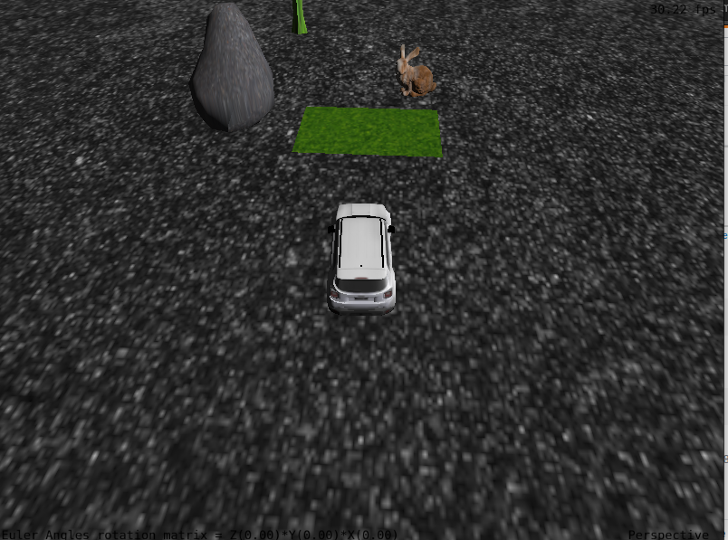
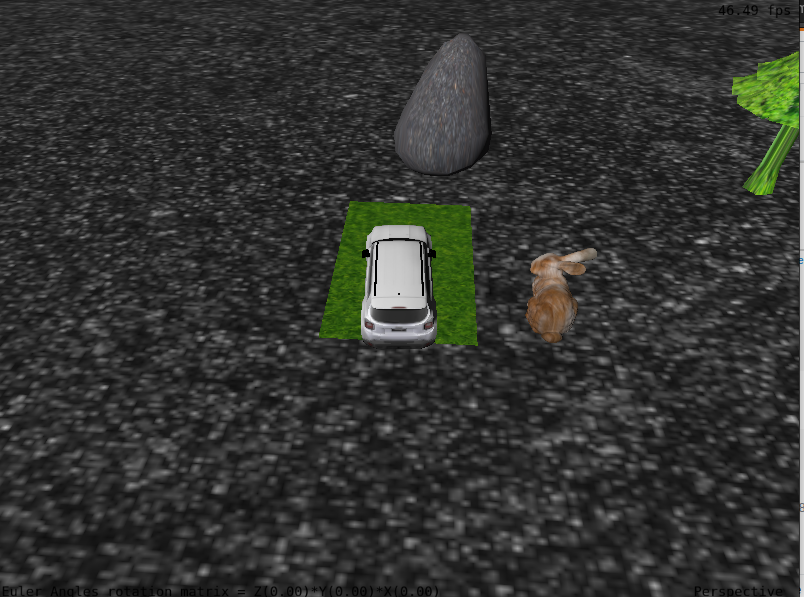

## Contribuicoes individuais
- Luis Roberto: carregamento dos objetos da cena e das texteuras, movimentação do carro, e camera livre
- Luis Filipe: carregamento dos objetos da cena e das texteuras, movimentação do carro, teste de colisões

## Sobre o uso de ferramentas
não foi feito o uso de chatGPT ou qualquer outro tipo de IA para escrever os codigos

## Processo de desenvolvimento
foi utilizado conceitos de transfomacoes geometricas para o movimento do carro, projecoes, modelos de iluminação para os obejtos da cena e também mapeamento de testuras para cada objeto,

## IMAGENS DO JOGO
img 1

img 2

## MANUAL
- Para movimentar o carro use as teclas WASD
- Aperte a tecla 'O' para alterar a projeção para uma projeção ortográfica. Aperte a tecla 'P' para alterar a projeção para uma projeção perspectiva;
- Aperte a tecla 'N' para mudar para uma camera livre
    - para mover a camera livre use as arrow keys
- Aperte a tecla 'M' para voltar para a camera look-at

## compilar
#### Windows

Para compilar e executar este projeto no Windows, baixe a IDE Code::Blocks em
http://codeblocks.org/ e abra o arquivo "Laboratorio_X.cbp".

**ATENÇÃO**: os "Build targets" padrões (Debug e Release) estão configurados
para Code::Blocks versão 20.03 ou superior, que utiliza MinGW 64-bits. Se você
estiver utilizando versões mais antigas do Code::Blocks (17.12 ou anteriores)
você precisa alterar o "Build target" para "Debug (CBlocks 17.12 32-bit)" ou
"Release (CBlocks 17.12 32-bit)" antes de compilar o projeto.

#### Linux

Para compilar e executar este projeto no Linux, primeiro você precisa instalar
as bibliotecas necessárias. Para tanto, execute o comando abaixo em um terminal.
Esse é normalmente suficiente em uma instalação de Linux Ubuntu:

    sudo apt-get install build-essential make libx11-dev libxrandr-dev \
                         libxinerama-dev libxcursor-dev libxcb1-dev libxext-dev \
                         libxrender-dev libxfixes-dev libxau-dev libxdmcp-dev

Se você usa Linux Mint, talvez seja necessário instalar mais algumas bibliotecas:

    sudo apt-get install libmesa-dev libxxf86vm-dev

Após a instalação das bibliotecas acima, você possui duas opções para compilação:
utilizar Code::Blocks ou Makefile.

##### Linux com Code::Blocks
Instale a IDE Code::Blocks (versão Linux em http://codeblocks.org/), abra o
arquivo "Laboratorio_X.cbp", e modifique o "Build target" de "Debug" para "Linux".

##### Linux com Makefile
Abra um terminal, navegue até a pasta "Laboratorio_0X_Codigo_Fonte", e execute
o comando "make" para compilar. Para executar o código compilado, execute o
comando "make run".
